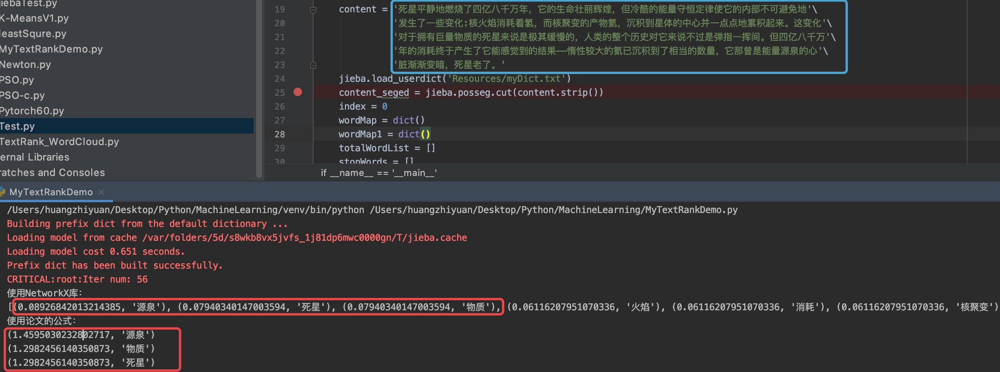
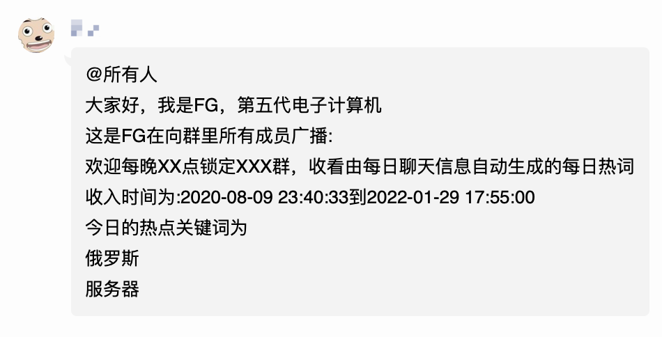

# nonebot-plugin-FG


## 简介

一个基于Nonebot2的QQ群每日总结生成插件，可以根据每日的聊天信息生成每日热词

**2.0版本的FG将以插件的形式存在**

1.0版本请访问：[FG](https://github.com/mgsky1/FG)

## 所用技术

首先会获取群内聊天记录进行数据预处理，包括Q号什么的进行数据脱敏。

FG的核心是一个称为[**TextRank**](assets/TextRank-algorithm.pdf)的算法，它源自于Google的PageRank，基本思想采用类似投票机制来找出一篇文章的关键词，这里为了稳定性，所以是**调库**。

如果想要更深入了解TextRank算法，可以阅读这篇论文[《TextRank: Bringing Order into Texts》](https://digital.library.unt.edu/ark:/67531/metadc30962/m2/1/high_res_d/Mihalcea-2004-TextRank-Bringing_Order_into_Texts.pdf)。同时，我自己也对论文的关键词提取做了实现[MyTextRankDemo.py](assets/MyTextRankDemo.py)。步骤上基本还原了论文的步骤。对于词组的匹配，由于我是使用结巴分词，可以用户自定义，所以这一步并没有按照论文实现。

自写代码运行效果如下所示：



## 环境

- Python 3.7+
- nonebot 2.0.0b1+(确保安装[定时任务插件](https://github.com/nonebot/plugin-apscheduler))
- [Onebot V11适配器](https://github.com/nonebot/adapter-onebot)

> 其他的适配器我没有测过，因为在代码中`from nonebot.adapters.onebot.v11.event import GroupMessageEvent`，所以感觉如果不用该适配器可能会有问题

## 安装

- 使用pip进行安装

```
pip install nonebot-plugin-fg
```

- 然后在bot中加载插件

```python
nonebot.load_plugin('nonebot_plugin_fg')
```

## 配置

### .env.*配置

以下配置请配置在nonbot项目的`.env.*`配置文件中：

```
# 启动定时任务
APSCHEDULER_AUTOSTART=true

# =====FG的配置开始=====
# 插件配置文件存放目录
FG_CONFIG_LOCATION=/path/to/fg/conf/json
# 群聊天记录存放目录前缀
FG_CHATLOG_DIR_PREFIX=/path/to/chatlog/dir/prefix
# 用户自定义字典位置
FG_USER_DICT_LOCATION=/path/to/user/dict/txt
# 用户自定义敏感词位置
FG_USER_SENSITIVE_DICT_LOCATION=/path/to/user/sensitive/words/txt
# =====FG的配置结束=====

```

### FG自身的配置文件

FG使用JSON格式来编写配置文件：

```json
[
  {
    "group_id": "string", // qq群号
    "trigger_hour": "int", // 触发时间(小时)
    "trigger_min": "int", // 触发时间(分钟)
    "word_num": "int", // 需要展示的热词数量
    "word_len": "int", // 单个关键词长度(小于该长度的关键词将不会被展示)
    "template_ok": "string", // 有热词时的模版 (热词数量 >= 配置数)
    "template_failed": "string" // 没有热词时的模版 (热词数量 < 配置数)
  },
  ...
]
```

每一个Q群是一个配置项，整体是一个JSON数组。

在`template_ok`配置项中，有以下规定：

> - 使用`\n`表示换行
> - 使用`${word}`表示**一个**热词的填充位置
> - 使用`${begin_time}`表示记录开始时间
> - 使用`${end_time}`表示记录结束时间

至于`template_failed`配置项，**暂时**只支持纯文本

下面是一个配置例子：

```json
[
  {
    "group_id": "123456",
    "trigger_hour": 23,
    "trigger_min": 0,
    "word_num": 2,
    "word_len": 3,
    "template_ok": "大家好，我是FG～\n本次产生热词的时间范围为:${begin_time}~${end_time}\n热词为：\n${word}\n${word}",
    "template_failed": "今天群里不够热闹哦～"
  }
]
```

### 自定义词典配置

用户可以设置自定义词典，来避免一些专有词被分词工具分割的情况。

例如：`三体人`是一整个词，如果不使用自定义词典，那么可能被分词工具分割成`三体`和`人`两个词，这是不合适的。

自定义词典的格式如下：

```
终产者 n // 空格前为词名，空格后为词性，由于关键词一般是名词，所以使用n(noun)
```

### 自定义敏感词配置

有时候我们可能不想某些词出现在最终的结果中，这些词可能是违规的，可能导致bot被封禁。因此，需要有自定义的敏感词配置。敏感词被放置在一个`txt`文本文件中，每一个词占一行

```
XXOO
是更
```

## ScreenShots


## 修订日志

- 2022.01.29 2.0版本，修复导包问题

## 致谢

- 机器人-丹尼尔·奥利瓦
- [来福](https://weibo.com/u/1650618111)
- [-禾呈-](https://www.hecheng.moe/)
- 部分代码修改自[TextRank4ZH](https://github.com/letiantian/TextRank4ZH)


## Note
FG也即Fifth Generation，第五代超级计算机，灵感来自于刘慈欣长篇科幻，《超新星纪元》
